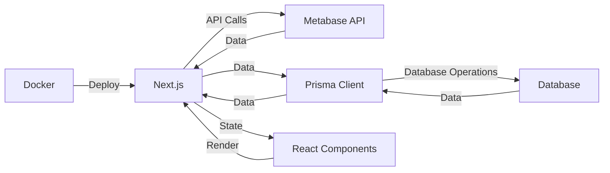

# Metabase Manager Documentation

## Table of Contents

1. [Metabase Manager Documentation](#metabase-manager-documentation)
   1. [Introduction](#introduction)
   2. [Overview](#overview)
2. [Installation](#installation)
	1. [Usage](#usage)
	2. [Docker Deployment](#docker-deployment)
	3. [Scripts](#scripts)
3. [Data Models](#data-models)
   1. [Card](#card)
   2. [Dashboard](#dashboard)
   3. [DatabaseMeta](#databasemeta)
   4. [Field](#field)
   5. [Server](#server)
   6. [SyncMapping](#syncmapping)
   7. [SyncStatus](#syncstatus)
   8. [SyncStatusText](#syncstatustext)
   9. [Table](#table)
4. [Metabase APIs Used](#metabase-apis-used)
5. [Architecture](#architecture)
6. [User Instructions](#user-instructions)
7. [Error Tracking and Logging](#error-tracking-and-logging)
   
## Introduction

Metabase Manager is a powerful tool designed to manage and synchronize Metabase instances. It provides a user-friendly interface for data analysts to manage their Metabase data, dashboards, and cards across different servers. The tool is built with Next.js and TypeScript, and it leverages the Metabase API for data synchronization.

## Overview

The Metabase Manager tool is designed to facilitate the process of managing and synchronizing Metabase instances. It provides a comprehensive solution for data analysts to manage their data, dashboards, and cards across different servers. The tool is built with a focus on ease of use, efficiency, and reliability.

The tool's functionality is primarily divided into four main areas:

1. **Data Models**: The tool uses several data models to represent the various entities it interacts with. These include `Card`, `Dashboard`, `DatabaseMeta`, `Field`, `Server`, `SyncMapping`, `SyncStatus`, `SyncStatusText`, and `Table`. These models are defined in the `types.ts` file.

2. **APIs**: The tool interacts with the Metabase API through several utility functions. These functions are used to create, update, and retrieve data from Metabase servers. They are defined in various files under the `app/api` directory.

3. **Architecture**: The tool is built with Next.js and TypeScript, and it follows a modular architecture. The main components of the tool are the`Home` component, the `ServerInput` component, and various utility functions.

4. **User Instructions**: The tool provides a user-friendly interface for data analysts to manage their Metabase instances. Users can initiate and manage synchronization processes through the tool's interface.

In the following sections, we will delve deeper into each of these areas.

# Installation
1. Clone the repository:

```bash
git clone https://github.com/coronasafe/metabase_manager.git
```

2. Change the current directory to the project root:

```bash
cd metabase_manager
```

3. Install dependencies:

```bash
npm install
```

4. Generate the Prisma client:
    
```bash
npx prisma generate
```

5. Perform an initial migration:

```bash
npx prisma migrate deploy
```

## Usage

1. Start the development server:

```bash
npm run dev
```

2. Open your browser and navigate to `http://localhost:3000` to view the application.

3. Add source and destination instances as needed.

4. Copy question cards between instances.

## Docker Deployment

1. Make sure you have Docker and Docker Compose installed on your system.

2. Clone the repository:

```bash
git clone https://github.com/coronasafe/metabase_manager.git
```

3. Change the current directory to the project root:

```bash
cd metabase_manager
```

4. Run the `docker-compose build` command to build the images for the services defined in the `docker-compose` file.

```bash
docker-compose -f docker-compose.yaml build
```

5. Once the images are built, you can start the services using the docker-compose up command.

```bash
docker-compose -f docker-compose.yaml up -d
```

6. Open your browser and navigate to `http://localhost:3000` to view the application.

## Scripts

- `dev`: Start the development server
- `prod`: Lint, build, and start the production server
- `build`: Build the application using Vite
- `server`: Start the server using ts-node
- `server:prod`: Start the production server using ts-node and cross-env
- `lint`: Lint the project with ESLint

# Data Models

The Metabase Manager tool uses several data models to represent the various entities it interacts with. These models are defined in TypeScript and they provide a structured way to interact with the data in the application. Here's a brief overview of each model:

## Card

The `Card` model represents a Metabase card, which is essentially a saved question. It includes fields such as `id`, `name`, `description`, `database_id`, `table_id`, `query`, and `visualization_settings`.

```typescript
interface Card {
  id: number;
  name: string;
  description: string;
  database_id: number;
  table_id: number;
  query: object;
  visualization_settings: object;
}
```
- `id` (number): The unique identifier of the card. It's used to reference the card in the database.
- `name` (string): The name of the card. It's used for display purposes.
- `description` (string): The description of the card. It's used for display and informational purposes.
- `database_id` (number): The identifier of the database that the card is associated with. It's used to link the card to a specific database.
- `table_id` (number): The identifier of the table that the card is associated with. It's used to link the card to a specific table.
- `query` (object): The query associated with the card. It's used to store the actual query that the card represents.
- `visualization_settings` (object): The settings for how the card's data should be visualized. It's used to customize the display of the card's data.

## Dashboard

The `Dashboard` model represents a Metabase dashboard. It includes fields such as `id`, `name`, `description`, and `cards`, which is an array of `Card` objects.

```typescript
interface Dashboard {
  id: number;
  name: string;
  description: string;
  cards: Card[];
}
```
- `id` (number): The unique identifier of the dashboard. It's used to reference the dashboard in the database.
- `name` (string): The name of the dashboard. It's used for display purposes.
- `description` (string): The description of the dashboard. It's used for display and informational purposes.
- `cards` (`Card`): An array of cards that are part of the dashboard. It's used to store the cards that make up the dashboard.

## DatabaseMeta

The `DatabaseMeta` model represents metadata about a Metabase database. It includes fields such as `id`, `name`, `is_sample`, `tables`, and `fields`.

```typescript
interface DatabaseMeta {
  id: number;
  name: string;
  is_sample: boolean;
  tables: Table[];
  fields: Field[];
}
```
- `id` (number): The unique identifier of the database metadata. It's used to reference the database metadata in the database.
- `name` (string): The name of the database. It's used for display purposes.
- `is_sample` (boolean): A flag indicating whether the database is a sample. It's used to differentiate sample databases from real ones.
- `tables` (`Table`): An array of tables in the database. It's used to store the tables that are part of the database.
- `fields` (`Field`): An array of fields in the database. It's used to store the fields that are part of the database.

## Field

The `Field` model represents a field in a Metabase table. It includes fields such as `id`, `name`, `table_id`, `description`, and `base_type`.

```typescript
interface Field {
  id: number;
  name: string;
  table_id: number;
  description: string;
  base_type: string;
}
```
- `id` (number): The unique identifier of the field. It's used to reference the field in the database.
- `name` (string): The name of the field. It's used for display purposes.
- `table_id` (number): The identifier of the table that the field is associated with. It's used to link the field to a specific table.
- `description` (string): The description of the field. It's used for display and informational purposes.
- `base_type` (string): The base type of the field. It's used to specify the data type of the field.

## Server

The `Server` model represents a Metabase server. It includes fields such as `id`, `name`, `url`, `api_key`, and `databases`, which is an array of `DatabaseMeta` objects.

```typescript
interface Server {
  id: number;
  name: string;
  url: string;
  api_key: string;
  databases: DatabaseMeta[];
}
```
- `id` (number): The unique identifier of the server. It's used to reference the server in the database.
- `name` (string): The name of the server. It's used for display purposes.
- `url` (string): The URL of the server. It's used to connect to the server.
- `api_key` (string): The API key for the server. It's used for authentication when connecting to the server.
- `databases` (`DatabaseMeta`): An array of databases on the server. It's used to store the databases that are part of the server.


## SyncMapping

The `SyncMapping` model represents a mapping between two Metabase servers for synchronization. It includes fields such as `id`, `source_server_id`, `destination_server_id`, `last_synced_at`, and `status`.

```typescript
interface SyncMapping {
  id: number;
  source_server_id: number;
  destination_server_id: number;
  last_synced_at: Date;
  status: SyncStatus;
}
```
- `id` (number): The unique identifier of the sync mapping. It's used to reference the sync mapping in the database.
- `source_server_id` (number): The identifier of the source server in the sync mapping. It's used to specify where the data is coming from.
- `destination_server_id` (number): The identifier of the destination server in the sync mapping. It's used to specify where the data is going to.
- `last_synced_at` (Date): The date and time when the last sync occurred. It's used to track when the data was last synced.
- `status` (`SyncStatus`): The status of the sync. It's used to track the progress and result of the sync.


## SyncStatus

The `SyncStatus` model represents the status of a synchronization process. It is an enumeration with values such as `NOT_STARTED`, `IN_PROGRESS`, `COMPLETED`, and `FAILED`.

```typescript
enum SyncStatus {
  NOT_STARTED = 'NOT_STARTED',
  IN_PROGRESS = 'IN_PROGRESS',
  COMPLETED = 'COMPLETED',
  FAILED = 'FAILED',
}
```
- `NOT_STARTED` ('NOT_STARTED'): The sync has not started yet.
- `IN_PROGRESS` ('IN_PROGRESS'): The sync is currently in progress.
- `COMPLETED` ('COMPLETED'): The sync has completed successfully.
- `FAILED` ('FAILED'): The sync has failed.


## SyncStatusText

The `SyncStatusText` model represents the text associated with a synchronization status. It is a map that associates `SyncStatus` values with their corresponding text.

```typescript
const SyncStatusText = {
  [SyncStatus.NOT_STARTED]: 'Not Started',
  [SyncStatus.IN_PROGRESS]: 'In Progress',
  [SyncStatus.COMPLETED]: 'Completed',
  [SyncStatus.FAILED]: 'Failed',
};
```
- `NOT_STARTED` ('Not Started'): The text representation of the `NOT_STARTED` status.
- `IN_PROGRESS` ('In Progress'): The text representation of the `IN_PROGRESS` status.
- `COMPLETED` ('Completed'): The text representation of the `COMPLETED` status.
- `FAILED` ('Failed'): The text representation of the `FAILED` status.

## SyncLog

The `SyncLog` model represents a log of a sync request in the application. It includes fields such as `id`, `timestamp`, `status`, `detailedRecords`, `sourceEmail`, `sourceHost`, and `destinationHost`.

```typescript
interface SyncLog {
  id: number;
  timestamp: Date;
  status: string;
  detailedRecords: any;
  sourceEmail: string;
  sourceHost: string;
  destinationHost: string;
}
```

- `id` (SERIAL): The unique identifier of the sync log. It's used to reference the sync log in the database.
- `timestamp` (TIMESTAMP): The timestamp when the sync request was made. It's used to track when each sync request occurred.
- `status` (TEXT): The status of the sync request. It's used to indicate whether the sync request was successful or not.
- `detailedRecords` (JSONB): Detailed records of the sync request. It's used to store detailed information about what happened during the sync request.
- `sourceEmail` (TEXT): The email of the source server. It's used to identify where the sync request originated from.
- `sourceHost` (TEXT): The host of the source server. It's used to identify where the sync request originated from.
- `destinationHost` (TEXT): The host of the destination server. It's used to identify where the sync request was sent to.

## Table

The `Table` model represents a table in a Metabase database. It includes fields such as `id`, `name`, `database_id`, `description`, and `fields`, which is an array of `Field` objects.

```typescript
interface Table {
  id: number;
  name: string;
  database_id: number;
  description: string;
  fields: Field[];
}
```
- `id` (number): The unique identifier of the table. It's used to reference the table in the database.
- `name` (string): The name of the table. It's used for display purposes.
- `database_id` (number): The identifier of the database that the table is associated with. It's used to link the table to a specific database.
- `description` (string): The description of the table. It's used for display and informational purposes.
- `fields` (`Field`): An array of fields in the table. It's used to store the fields that are part of the table.


These models are used throughout the application to interact with the Metabase API and to manage the state of the application. They provide a structured way to represent the data in the application and they make it easier to understand and manage the data.

# Metabase APIs Used

1. **Collection API**: This API is used to fetch all collections. It is a GET request to `${host}/api/collection`. This API is used when you need to retrieve all collections from Metabase. 

   Purpose: To fetch all collections from Metabase.

   Example code:
   ```javascript
   const response = await fetch(`${host}/api/collection`, {
     headers: {
       'X-Metabase-Session': session_id,
     },
   });
   const collections = await response.json();
   ```

2. **Collection Items API**: This API is used to fetch all dashboards in a collection. It is a GET request to `${host}/api/collection/${collection.id}/items?models=dashboard`. This API is used when you need to retrieve all dashboards within a specific collection.

   Purpose: To fetch all dashboards within a specific collection.

   Example code:
   ```javascript
   const response = await fetch(`${host}/api/collection/${collectionId}/items?models=dashboard`, {
     headers: {
       'X-Metabase-Session': session_id,
     },
   });
   const dashboards = await response.json();
   ```

3. **Dashboard API**: This API is used to fetch a specific dashboard. It is a GET request to `${host}/api/dashboard/${dashboard_id}`. This API is used when you need to retrieve a specific dashboard by its ID.

   Purpose: To fetch a specific dashboard by its ID.

   Example code:
   ```javascript
   const response = await fetch(`${host}/api/dashboard/${dashboardId}`, {
     headers: {
       'X-Metabase-Session': session_id,
     },
   });
   const dashboard = await response.json();
   ```

4. **Database API**: This API is used to fetch all databases. It is a GET request to `${host}/api/database`. This API is used when you need to retrieve all databases from Metabase.

   Purpose: To fetch all databases from Metabase.

   Example code:
   ```javascript
   const response = await fetch(`${host}/api/database`, {
     headers: {
       'X-Metabase-Session': session_id,
     },
   });
   const databases = await response.json();
   ```

5. **Database Metadata API**: This API is used to fetch metadata of a specific database. It is a GET request to `${host}/api/database/${database}/metadata`. This API is used when you need to retrieve metadata for a specific database.

   Purpose: To fetch metadata for a specific database.

   Example code:
   ```javascript
   const response = await fetch(`${host}/api/database/${databaseId}/metadata`, {
     headers: {
       'X-Metabase-Session': session_id,
     },
   });
   const metadata = await response.json();
   ```

6. **Card API**: This API is used to create or update a card (a saved question in Metabase). 

   - `POST /api/card`: Creates a new card. 
   - `PUT /api/card/:id`: Updates an existing card. 

   Purpose: To create or update a card in Metabase.

   Example code:
   ```javascript
   let method = "POST";
   let url = `${dest_host}/api/card`;
   let cardData = { /* card data */ };

   if (dest_card_id !== undefined) {
     method = "PUT";
     url = `${dest_host}/api/card/${dest_card_id}`;
   }

   const response = await fetch(url, {
     method: method,
     headers: {
       'Content-Type': 'application/json',
       'X-Metabase-Session': session_id,
     },
     body: JSON.stringify(cardData)
   });
   const card = await response.json();
   ```

7. **Collection Tree API**: This API is used to fetch the collection tree. It is a GET request to `/api/collection/tree`.

   Purpose: To fetch the collection tree from Metabase.

   Example code:
   ```javascript
   const url = `${host}/api/collection/tree?tree=true&exclude-other-user-collections=true&exclude-archived=true`;
   const response = await fetch(url, {
     method: "GET",
     headers: {
       'Content-Type': 'application/json',
       'X-Metabase-Session': session_id,
     },
   });
   const collectionTree = await response.json();
   ```

8. **Native Dataset API**: This API is used to execute a native (SQL) query against a database in Metabase. It is a POST request to `/api/dataset/native`.

   Purpose: To execute a native SQL query against a database in Metabase.

   Example code:
   ```javascript
   const query = { /* SQL query and database ID */ };
   const response = await fetch(`${host}/api/dataset/native`, {
     method: "POST",
     headers: {
       'Content-Type': 'application/json',
       'X-Metabase-Session': session_id,
     },
     body: JSON.stringify(query)
   });
   const dataset = await response.json();
   ```

9. **Database API**: This API is used to fetch all databases. It is a GET request to `/api/database`.

   Purpose: To fetch all databases from Metabase.

   Example code:
   ```javascript
   const response = await fetch(`${host}/api/database`, {
     method: "GET",
     headers: {
       'Content-Type': 'application/json',
       'X-Metabase-Session': session_id,
     },
   });
   const databases = await response.json();
   ```

All these APIs require the `X-Metabase-Session` header for authentication. The session ID can be obtained by making a POST request to `${host}/api/session` with the username and password.

# Architecture

The application is a Next.js application with a Prisma client for database interactions. It's designed to manage and synchronize Metabase instances.

Here are the major components:

1. **Next.js**: This is the core framework used for building the application. It handles routing, server-side rendering, and the overall structure of the application. The main entry point is the `Home` function in `app/page.tsx`.

2. **Prisma Client**: This is used for database interactions. It's generated with the `npx prisma generate` command as described in the `README.md`.

3. **React Components**: The application uses React for building the UI. Components like `ServerInput` are used to manage the state of source and destination servers.

4. **Docker**: The application can be deployed using Docker, as described in the Docker Deployment section of the`README.md`.

The application allows users to add source and destination instances, and copy question cards between these instances. The state of the servers is managed within the `Home` function in `app/page.tsx`, and changes to the servers trigger updates to the`syncStatus` state.

Sure, here's a simple Mermaid diagram that represents the architecture of your application:



In this diagram:

- "Next.js" represents the core application framework.
- "Metabase API" represents the external Metabase API that the application interacts with.
- "Prisma Client" represents the database client used for database operations.
- "Database" represents the actual database where data is stored.
- "React Components" represents the UI components of the application.
- "Docker" represents the deployment mechanism for the application.

# User Instructions
Here are the step-by-step instructions for data analysts to initiate and manage synchronization processes:

1. **Deploy the Application**: Deploy the application using Docker or your preferred deployment method. If you're using Docker, you can use the provided `Dockerfile` and the command `docker build -t metabase-manager . && docker run -p 3000:3000 metabase-manager`.

2. **Open the Application**: Open your web browser and navigate to the URL where the application is deployed. If you're running it locally, this will typically be `http://localhost:3000`.


3. **Add Source Server**: Click on the "Add Source Server" button. Enter the hostname of your Metabase instance, along with your username and password. Once authenticated, you'll be able to select the collection and database you want to sync. You can add multiple source servers if needed.


4. **Add Destination Server**: Click on the "Add Destination Server" button. Enter the hostname of your destination Metabase instance, along with your username and password. Once authenticated, you'll be able to select the collection and database where you want to sync the data. Additionally, you can also select certain card IDs you want to force exclude from the synchronization process.


5. **Proceed**: After adding all the source and destination servers, click on the "Proceed" button.

6. **Select Items to Sync**: You will now see a list of all questions and dashboards from your source servers. You can select individually which items you want to sync to the destination servers.


7. **Sync**: After selecting all the items you want to sync, click on the "Sync" button. All the selected items will be synced to the destination servers.

8. **Manage Sync**: You can manage the synchronization process by adding or removing source and destination servers, selecting different items to sync, and initiating the sync process whenever needed.

> [!TIP]
> For ease of use, once you have added the source and destination servers, you have the ability to import and export your configuration as a JSON file. This can be particularly useful for backup purposes, migrating your configuration to another system, or sharing your configuration with others.

Remember to always ensure that you have the necessary permissions to perform these operations on both the source and destination servers.

# Error Tracking and Logging

In our application, we use Sentry for error tracking. Sentry provides real-time error tracking that gives you insight into production deployments and information to reproduce and fix crashes.

We have set up Sentry in three different configurations:

1. [Client-side Sentry configuration](sentry.client.config.ts): This configuration is used whenever a user loads a page in their browser.
2. [Server-side Sentry configuration](sentry.server.config.ts): This configuration is used whenever the server handles a request.
3. [Edge-side Sentry configuration](sentry.edge.config.ts): This configuration is used for edge features like middleware and edge routes.

Each of these configurations uses a DSN (Data Source Name) to connect to the Sentry service. The `tracesSampleRate` option is set to `1`, which means that 100% of transaction traces are sent to Sentry. The `debug` option is set to `false`, which means that debug information is not printed to the console.

In addition to Sentry, we also log each sync request permanently in our database. This is done using the [`createSyncLog`](app/api.ts) function in [app/api.ts](app/api.ts). This function takes several parameters including the status of the request, detailed records of the request, and information about the source and destination of the request. It then makes a POST request to the `/database/logging` endpoint, which is handled by the [`POST`](app/api/database/logging/route.ts) function in [app/api/database/logging/route.ts](app/api/database/logging/route.ts).

The database model for the sync log includes fields for the status, detailed records, source email, source host, and destination host. These fields are used to provide detailed information about each sync request, which can be useful for troubleshooting and understanding the behavior of the application.